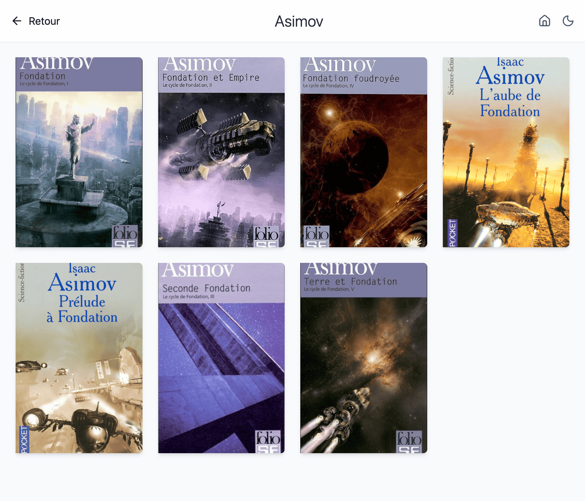

# PyOPDS Server - OPDS Server for EPUB Library

This project is a lightweight OPDS (Open Publication Distribution System) server written in Python 3, designed to expose a library of EPUB files stored in a local directory, compatible with clients like Calibre, KoReader, or any other OPDS-compliant reader. It uses only Python's standard libraries.


If you browse your OPDS feed in a web browser, it will display a simple HTML representation of the feed using XSLT transformation.





## Features

- **OPDS Catalog**: Exposes EPUB books via an OPDS feed accessible at the `/opds` endpoint.
- **Subdirectory Support**: Scans EPUB files in the configured directory and its subdirectories.
- **Sorted by Most Recent**: Books are listed in the OPDS feed sorted by modification date, with the most recently modified files appearing first.
- **Metadata Extraction**: Extracts title and author from EPUB files for rich display in the catalog.
- **KoReader Sync API**: Optional JSON endpoints that store and replay reading progress shared by KoReader devices.
- **Docker Deployment**: Includes a `Dockerfile` and `docker-compose.yml` for easy containerized deployment.
- **Visual HTML Representation**: Provides a simple HTML view of the OPDS feed for easy browsing in web browsers (using XSLT transformation).

## Prerequisites

- **Python 3.12+** (if running without Docker).
- **Docker** and **Docker Compose** (for containerized deployment).
- A directory containing EPUB files (e.g., `books/`).

## Installation

### With Docker

1. Clone the repository:

   ```bash
   git clone https://github.com/your-username/your-repo.git
   cd your-repo
   ```

2. Create a `books/` directory and place your EPUB files in it (e.g., `books/author1/book.epub`).
3. Start the server with Docker Compose:

   ```bash
   docker-compose up --build
   ```

4. Access the OPDS catalog at: `http://localhost:8080/opds`.

### Without Docker

1. Clone the repository:

   ```bash
   git clone https://github.com/your-username/your-repo.git
   cd your-repo
   ```

2. Set the environment variable for the books directory:

   ```bash
   export LIBRARY_DIR=/path/to/your/books
   ```

3. Start the server:

   ```bash
   python server.py
   ```

4. Access the OPDS catalog at: `http://localhost:8080/opds`.

## Configuration

The following environment variables can be set:

- **LIBRARY_DIR**: Path to the directory containing EPUB files (default: `books`).
- **KOREADER_SYNC_DB_PATH**: Path to the SQLite database file used by the KoReader sync helper (default: `koreader_sync.db`).
- **KOREADER_SYNC_TOKEN**: Shared secret token required for accessing `/koreader/sync`. If unset, the sync endpoints accept requests without authentication.

For Docker, modify these variables in the `docker-compose.yml` file:

```yaml
services:
  opds-server:
    build: .
    ports:
      - "8080:8080"
    volumes:
      - ./books:/books
    environment:
      - LIBRARY_DIR=/books
```

## Usage with an OPDS Client

1. In an OPDS-compatible client (e.g., KoReader or Calibre):
   - Add a new catalog with the URL: `http://<your-ip>:8080/opds`.
2. Browse the book list at the `/opds/books` endpoint.
3. Download books via the links provided in the OPDS feed.

## KoReader Sync API

The server exposes lightweight sync endpoints that allow KoReader clients to upload and download reading progress.

### Authentication

Set the `KOREADER_SYNC_TOKEN` environment variable and provide the same value from KoReader using an `Authorization: Bearer <token>` header (or `X-Auth-Token`/`?token=` query parameter). Requests without the correct token are rejected with `401 Unauthorized`.

### Endpoints

- `POST /koreader/sync`
  - **Body**: JSON object with `user`, `device`, and a list of progress entries under `records` (also accepts `documents` or `entries`). Each entry must contain a `document` identifier and any additional progress metadata.
  - **Response**: JSON summary of the stored documents together with the server timestamp.
- `GET /koreader/sync`
  - **Query Parameters**:
    - `user` (required): User identifier whose records should be returned.
    - `device` (optional): Restrict results to a specific device.
    - `since` (optional): Unix timestamp (float) to return updates newer than the provided value.
    - `limit` / `offset` (optional): Pagination controls.
  - **Response**: JSON payload containing the stored records, their timestamps, and metadata needed for KoReader to merge updates.

Data is stored in a local SQLite database (`KOREADER_SYNC_DB_PATH`) and deduplicated by the combination of user, device, and document identifier.

## Security Consideration

This server is designed to be lightweight and does not include built-in authentication or HTTPS support. For production use, it is strongly recommended to place the server behind a reverse proxy (e.g., SWAG, Nginx, or Nginx Proxy Manager).

## License

This project is licensed under the MIT License. See the `LICENSE` file for details (to be added if necessary).
